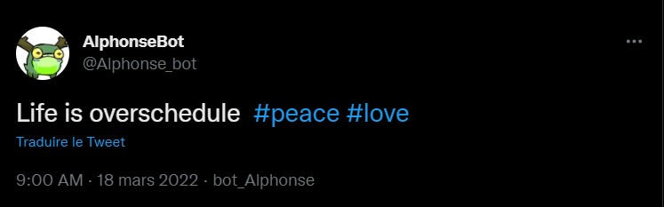
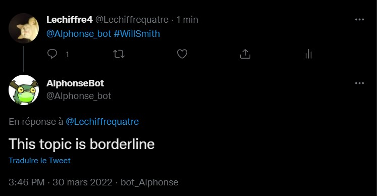

# Alphonse_Twitter_Bot

Alphonse est un bot twitter qui vis tout simplement sa vie.

Fonctionnalités :
    - 1 poste par jour de type " Life is ... " avec plusieurs hashtag
    - il est capable d'analyser l'ambiance global d'une tendance twitter

Technologie utilisé: 
    - Module Tweepy avec l'API étendu de Twitter
    - Module NLTK de reconnaissance de sentiment à partir de texte

Exemples de tweets : 

##Life is ... 

##Reply 

